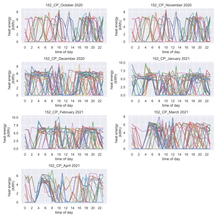

# Some artifacts from data analysis
In this area, I will display some interesting creations.

### 1. Creativity
Creativity in music is so refreshing!

### 2. Colour-blind friendly figures and plots
According to [Colblindor](https://www.color-blindness.com/), colour blindness affects approximately every 1 in 12 men (8%) and 1 in 200 women (0.5%). These are significant numbers. I have included a link on my read me page for a useful palette helper for choosing the apprpriate colour-blind safe colours to add in plots. It is a free service called Chroma.js Color Palette Helper.

### 3. Monthly heat demand profiles
Ohh who doesn't love food! So here is one recipe! Add pandas in a mixture of matplotlib, seaborn and numpy, then season with a pythonic for loop. This is what you get! Food to the eyes!

